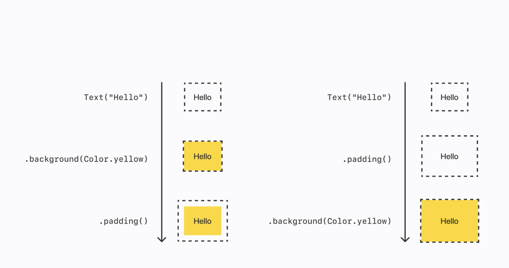
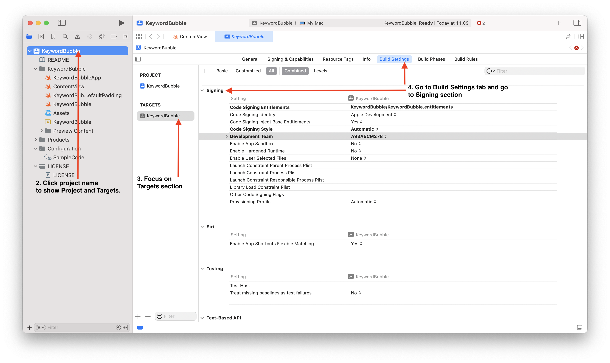

# Swift

Swift is a general-purpose programming language design by Apple released on 2014. It can be use to develop software for Apple products, [server](https://www.youtube.com/watch?v=OWNjtWUb9bs), and [embedded device](https://www.youtube.com/watch?v=LqxbsADqDI4). Swift by syntax share similarity with strict type programming language like Java, Go, and PHP (version 8 and above). I try Swift in Swift Playgrounds and I create a YouTube playlist of my progress to learn Swift: [Swift Playgrounds - Learn to Code 1](https://www.youtube.com/playlist?list=PL1624iL4Ia7WokXFwxA_-Dm30lg7uFnIS) and [Swift Playgrounds - Learn to Code 2 - Quick Review](https://youtu.be/RG8FS6xyc1Y).

## Syntax

In Swift, you can declare variable in two ways: a mutable variable with `var` keyword and immutable variable with `let` keyword. Mutable variable means you can change the value of variable after you declare a variable. Immutable variable means you cannot change the value of variable after you declare a variable.

```swift
// Mutable variable with `var` keyword.
var count = 2
count = 3 // It works

// Immutable variable with `let` keyword.
let name = "Kresna"
name = "Satya" // It doesn't work.
```

Swift also a strict-type programming language. It means when you declare a mutable variable with specific type (e.g. Int) then you can only change the value of variable only with Int type.

```swift
var count = 1
count = 2 // Allowed
count = "foo" // Not allowed and it will throw error
```

Swift doesn't need a semicolon `;` after you declare variable. Also, Swift doesn't need parentheses when declare control flow statement, loop statement.

```swift
var isRain = true

if isRain {
    print("bring umbrella") // Output result.
} else {
    print("let's go")
}

for index in 1...5 {
    print("\(index) time 5 is \(index * 5)")
}
// Ouput:
// 1 times 5 is 5
// 2 times 5 is 10
// 3 times 5 is 15
// 4 times 5 is 20
// 5 times 5 is 25
```

If you want to concat variable in a string you can use `\()` syntax or `+` operator.

```swift
let firstName = "Kresna"
let lastName = "Satya"
print("My name is \(firstName) \(lastName)") // My name is Kresna Satya
print("My name is " + firstName + " " + lastName) // My name is Kresna Satya
```

## SwiftUI

## SwiftUI

SwiftUI is a Swift framework to create a User Interface for app in Apple products. It was released on 2019 at WWDC2019. When [I watch the announcement of SwiftUI](https://www.youtube.com/watch?v=psL_5RIBqnY&t=7675s), [my mind was blown away!](https://www.youtube.com/watch?v=psL_5RIBqnY&t=7712s) I cannot believe that you can shipped less code to build User Interface for mobile app. In the past, I build Android App with Java programming + XML on Android Studio. Now, Kotlin replace Java as a recommended programming language to build Android App so you can write less code to build User Interface for Android App. But, if I compare Kotlin with SwiftUI by syntax, SwiftUI is a winner because of less code. Here's comparison between SwiftUI and Kotlin when create a screen "Hello, World".

::: code-group

```swift [ContentView.swift]
    import SwiftUI

    struct ContentView: View {
        var body: some View {
            Text("Hello, World")
        }
    }

    #Preview {
        ContentView()
            .environment(ModelData())
    }
```

```java [MainActivity.kt]
    package com.example.greetingcard

    import android.os.Bundle
    import androidx.activity.ComponentActivity
    import androidx.activity.compose.setContent
    import androidx.compose.foundation.layout.fillMaxSize
    import androidx.compose.foundation.layout.padding
    import androidx.compose.material3.MaterialTheme
    import androidx.compose.material3.Surface
    import androidx.compose.material3.Text
    import androidx.compose.runtime.Composable
    import androidx.compose.ui.Modifier
    import androidx.compose.ui.graphics.Color
    import androidx.compose.ui.tooling.preview.Preview
    import androidx.compose.ui.unit.dp
    import com.example.greetingcard.ui.theme.GreetingCardTheme

    class MainActivity : ComponentActivity() {
        override fun onCreate(savedInstanceState: Bundle?) {
            super.onCreate(savedInstanceState)
            setContent {
                GreetingCardTheme {
                    // A surface container using the 'background' color from the theme
                    Surface(
                        modifier = Modifier.fillMaxSize(),
                        color = MaterialTheme.colorScheme.background
                    ) {
                        Greeting("Android")
                    }
                }
            }
        }
    }

    @Composable
    fun Greeting(name: String, modifier: Modifier = Modifier) {
        Surface(color = Color.Cyan) {
            Text(
                text = "Hi, my name is $name!",
                modifier = modifier.padding(24.dp)
            )
        }
    }

    @Preview(showBackground = true)
    @Composable
    fun GreetingPreview() {
        GreetingCardTheme {
            Greeting("Meghan")
        }
    }
```

:::


I can say that SwiftUI is better than Kotlin. Maybe sounds trivial or weird for you but for me if I want to see the programming language is good or bad, I will see by the syntax definition at first. I think I don't want to back to programming Kotlin for Android app for a distant moment. I'm using MacBook Air M1 with 256GB storage and 8GB of RAM for programming with Swift and SwiftUI in Xcode. I can't believe that this machine is strong enough to do that! Thanks Apple Silicon.

### Learning Resources

> Repeat, repeat, and repeat again until you understand!

#### Develop in Swift

This is the first stop to start learning Swift and SwiftUI. When I first time visit this site, it feels like I'm in a vast forest.
A lot of informations appears and blown my head! A lot of things to try and try again to understand how it works.
It's a great journey! No, no! I don't mean this site is bad! Instead this site is really-really well! It gives me step-by-step how to do that with clear explanation with code snippet, image, and preview.

__Site__: [Develop in Swift | Apple Developer Documentation](https://developer.apple.com/tutorials/develop-in-swift)

#### SwiftUI Tutorials

This is the next site to pick after you try **Develop in Swift**. This site will give you a comprehensive tutorial how to code with SwiftUI by create a project called "Landmarks". You will learn SwiftUI Essentials, Drawing and animation, App Design and layout, Framework integration.

__Site__: [SwiftUI Tutorials | Apple Developer Documentation](https://developer.apple.com/tutorials/swiftui)

#### SwiftUI Concepts

After you try **Introducing SwiftUI**, you must visit and read the SwiftUI Concepts. It covers structure of a Swift app project, how to layout, and how to state and data flow. It also gives you a code sample to try in your Xcode. But, becareful you may not be able to run the code sample on Xcode because of different Team. The error will be _Error: No Signing certificate “Mac Development” found_. Fortunately, I write a guide how to solve this problem in [Xcode tools section](/tools/xcode).

__Site:__ [SwiftUI Concepts | Apple Developer Documentation](https://developer.apple.com/tutorials/swiftui-concepts)

#### Sample Apps Tutorials

This site covers sample apps build with Swift and SwiftUI from navigating apps, presenting content, retrieving content from a server, responding to user input, capturing and displaying photos, and get started with machine learning.

__Site:__ [Sample Apps Tutorials | Apple Developer Documentation](https://developer.apple.com/tutorials/sample-apps)

### Padding in SwiftUI

The `.padding` modifier creates a new padded view with empty space around it, which is affected by any modifiers coming after it. If you want the padded area to have background color, you must modify that padded view.

::: code-group

```swift [ContentView.swift]
// ChatPrototype

import SwiftUI

struct ContentView: View {
		var body: some View {
				VStack {
						Text("Hello")
								.background(Color.yellow)
								.padding()
						Text("Hello")
								.padding()
								.background(Color.yellow)
				}
				.padding()
		}
}
```

:::



## Xcode

I can't believe that I can use Xcode for programming Swift and SwiftUI with MacBook Air M1 with 256GB storage and 8GB of RAM. I can't believe that this machine is strong enough to do that! Thanks Apple Silicon.

### Error: No Signing certificate “Mac Development” found

There's a case when you run a code sample from third party and you get error message below. Here's the example.

> No signing certificate "Mac Development" found: No "Mac Development" signing certificate matching team ID "A93A5CM278" with a private key was found. 
(in target 'Keyword Bubble' from project 'KeywordBubble')

### How to solve it?

1. Open your project in Xcode
2. On the project navigator, click project name to show **Project and Targets.**
3. Focus on **Targets** section.
4. In **Targets > Build Settings > Signing**
    1. Change value of **Code Signing Identity** to **Sign to run locally**
    2. Change value of **Code Signing Style** to **Manual**
    3. Change value of **Development Team** to **Personal** or **None**
5. Try again and see if works!

